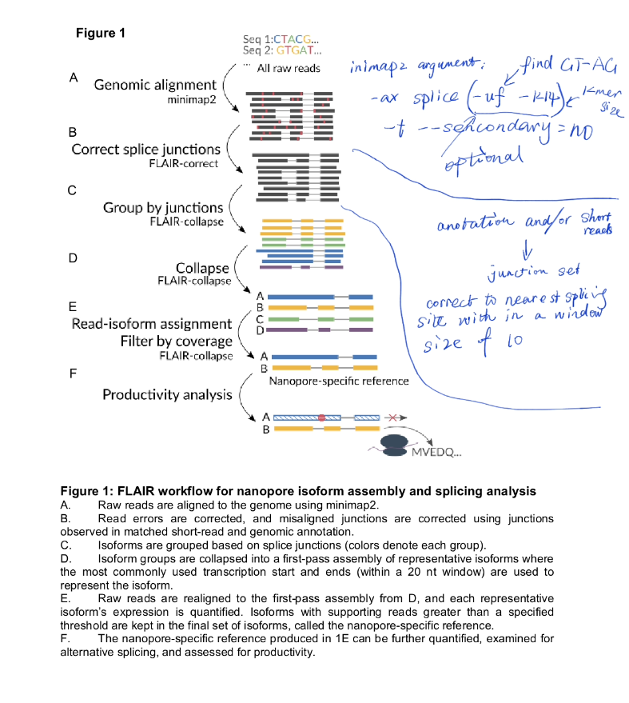

## Introduction

FLAIR (Full-length Alternative Isoform analysis of RNA)

assemble comeplete isoforms from higher-error nanopore reads reads with high-accurracy at splice junctions for consequent analysis of alternative isoform usage between sequenced samples.

## Methods:

Note: Sites that align outside of the wiggle room to canonical splice motifs with 3 supporting reads, but no annotation or short support, are deemed novel. However, these novel splice sites were removed from the further analyses due to their low confidence. 

