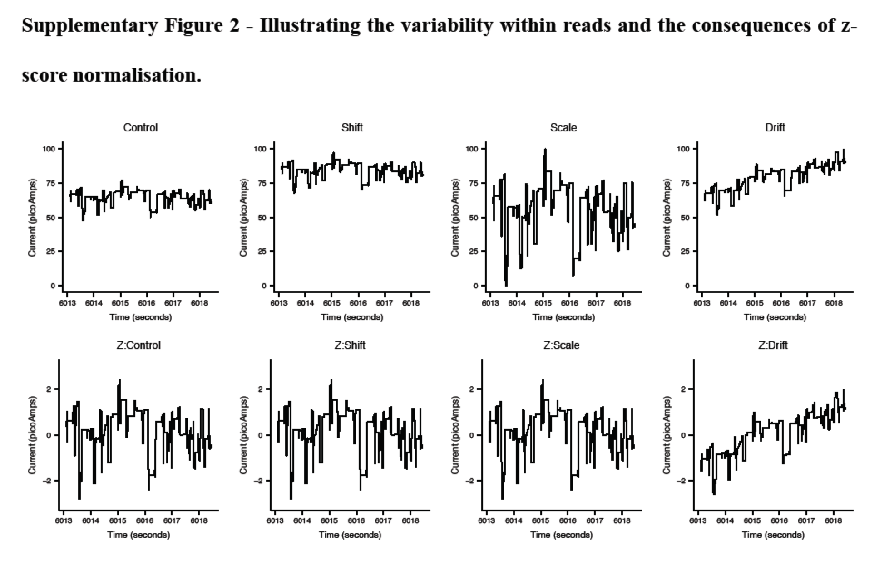

#Objective:
Select subset of DNA from a pool of molecules for sequencing with minimal specialized library preparation based on the identity of an initial set of sequenced bases.(Software: Read Until).

#Motivation:
* Current sequencing methods can result in unnecessary sequencing. 
* The ratio of interested region can not be modified after library preparation is complete.
* The problem of ratios cannot be detected during sequencing.

#Advantage of Nanopore seq
* the voltage across the pore could be reversed so that reject the individual DNA molecules to be seqenced
* Reads that are rejected are unlikely to be sequenced again [^1]

[^1]: The motor protein will have already migrated along the DNA and will not be available to slow the translocation of DNA through the pore. 

#Approach: matching squiggle 
Compare bases to a reference may have problems that the real-time basecalling implimentations are currently to slow and need subsequent optimiztions th improve quaulity.

The matching of two squiggles is complicated, including voltage changes, noise and interactions between channels. These behaviors are captured by shift, scale and drift.z-score normalization can be used to overcome shift and scale. However drift is insignificant in short nanopore traces, 

##Generate squiggle from nucleotide sequence.

To do squiggle matching, the reference sequences have to been converted to squiggles. For each k-mer in the reference, the expected mean current calue from the model file is calculated as squiggle value.

**Figure S2: Top row is a simulation of shift, acle and drift. Bottem row is Z-score normalised.**

## Dynamic time warping (DTW)

DTW is guaranteed to find the optimal alignment of two series of **time-ordered** data, which has been used in the analysis of sequence data. The naive DTW has O(m\*n), where m is reference length and n is query length. The speed of match by DTW is constrained by m. In theory, DTW can be applied to genomes up to 5 Mb in length. It's main idea is to find best possible alignment between two time series rather than use just some distances and is able to **ignore shifts in time dimention.**

An explaination of DTW see: [https://www.youtube.com/watch?v=tfOevFKQIjQ](https://www.youtube.com/watch?v=tfOevFKQIjQ)

There are some points to be noted:

* DTW treats the squiggle as a serie of discrete points
* A range of distance metrics are available. (Euclidean, absolute, Manhattan distance...)
* A cost Matrix(C) need to be predefined for the lowest cost of moving. C[i,j] = min(C[i-1,j],C[i,j-1],C[i-1,j-1]+D[i,j])

* The complexity is O(m\*n)

###An inportance variation of DTW for sub-sequence alignment is termed subsequence DTW (sDTW) 

Variation: row C[0,1..n] is initialised the same as D[0,1..n].
