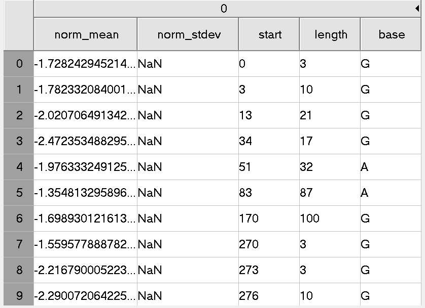

<style>
.column-left{
  float: left;
  width: 50%;
  text-align: left;
}
.column-center{
  display: inline-block;
  width: 100%;
  text-align: center;
}
.column-right{
  float: right;
  width: 50%;
  text-align: left;
}
</style>

## Squiggle alignment 

### Tombo resquiggle

Function:<br/>
The re-squiggle algorithm defines a new assignment from squiggle to reference sequence, hence a re-squiggle.

Input:<br/>
FAST5 files (contaioning raw signal and **associated base calls**.)

Output:<br/>
The resquiggle command will add the mapped reference loacation and the raw seqeunce assignment to the .fast5 read files provided, as well as index file for more efficient file access.

<center>
{width=60%}
</center>

```{bash, eval = F}
# annotate raw FAST5s with FASTQ files produced from the same reads
# skip this step if raw read files already contain basecalls
tombo preprocess annotate_raw_with_fastqs --fast5-basedir <fast5s-base-directory> --fastq-filenames <reads.fastq>

tombo resquiggle <fast5s-base-directory> <reference-fasta> --processes 4 --num-most-common-errors 5
```

By running `tombo resquiggle` we can the the index of data points than belong to the junction region:

For all the spike-in reads with barcode 7, we ran the following code:
```{bash, eval = F}

FAST5_DIR=/data/cephfs/punim0614/yupei/dataset/cDNA/test_subset_seq_run_1213_barcode_7/fast5s
FASTQ_PATH=/data/cephfs/punim0614/yupei/dataset/cDNA/test_subset_seq_run_1213_barcode_7/test_fastq.fq
REF=/home/youyupei/PhD_proj/cDNA_dataset_Analyses/Sequin_resources/rnasequin_sequences_2.2.fa

# annotate raw FAST5s with FASTQ files produced from the same reads
# skip this step if raw read files already contain basecalls
tombo preprocess annotate_raw_with_fastqs --fast5-basedir $FAST5_DIR --fastq-filenames $FASTQ_PATH

tombo resquiggle $FAST5_DIR $REF --processes 8 --num-most-common-errors 5
```

### Tombo result

The fast5 file processed by `tombo resquiggle` contains:

1. Original signal data

2. fastq information.

3. BAM file infromation (minimap2)

4. Signal to reference alignment result.


