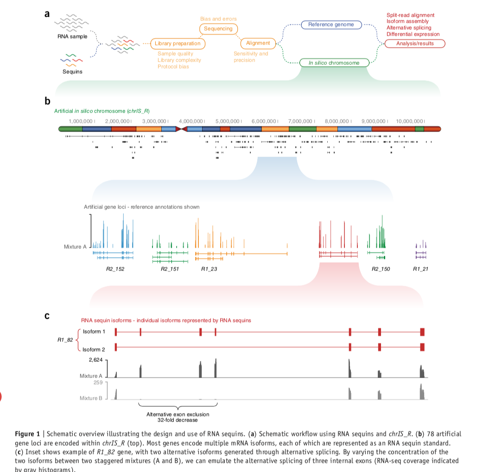

## Introduction

This is a summary of lab protocol and data analyses of using spike-ins with RNA sequecing. Original pdf: [https://s3.amazonaws.com/sequins/website/rna_resources/Sequin_Protocol_RNAseq_4.3.pdf](https://s3.amazonaws.com/sequins/website/rna_resources/Sequin_Protocol_RNAseq_4.3.pdf)
And the paper: [spliced synthetic genes as internal controls in rNA sequencing experiments](https://www-nature-com.ezp.lib.unimelb.edu.au/articles/nmeth.3958.pdf)

## Protocol 

### Dilute to target concentration

### Spike into RNA sample
  + Added prior to processing steps (e.g. poly-A enrichment or rRNA depletion).
  + Two mixture formulations-Mix A and B (same transcripts but different molar ratios) thereby emulating fold-change differences in gene expression and alternative splicing between the two mixtures.
  + A and B are alternatively added but do not add both in a single sample

### Library preparation and sequencing (Not relavant)

## Sequin analysis

+ Sequins repsent full-length apliced mRNA isoforms. 
+ Entirely artificial with no homology to natural reference genomes.
+ Combination of multiple sequins across concentrations emulates alternative splicing differential gene expression.
+ Provides scaling factors for noirmalization betwwen samples

### Motivation:
+ Accurate resolution of gene expression is confounded by the sheer size complexity of the transcriptome.
+ Technical variables during library preparation, sequencing and bioinformatic analysis.

### Analyses:

+ Entirely exogenous RNA modelcule
+ the spike-ins undergo identical procedure so that the error distributions and normalized coverages are similar. (Assess isoform assembly)
+ Compare the expected fold-change between Mix A and B with the observation(scaler for DE)
