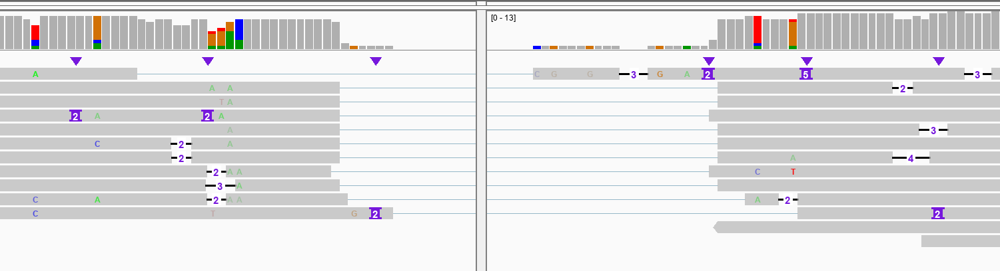
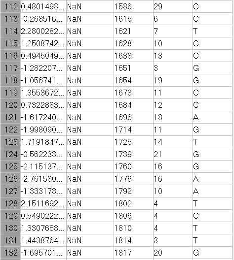
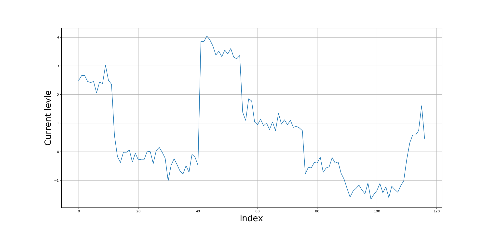

<style>
.column-left{
  float: left;
  width: 50%;
  text-align: left;
}
.column-center{
  display: inline-block;
  width: 100%;
  text-align: center;
}
.column-right{
  float: right;
  width: 50%;
  text-align: left;
}
</style>

## Data preprocessing

### Data description

#### cDNA data

This is data shared by Mike and downloaded on 22 Mar 2019.
The dataset contains raw data, fastq's and sequencing summary files.


It a Nanopore cDNA dataset with Sequin controls:

It's 4 technicals replicates of a differentiated SHSY5Y sample with Sequin spike-ins. 

  * 2 samples have spike-in mix A, two mix B, which means there should be DE of the spike-ins. These are the V2 spike-ins.

  * All libraries were made from a pool of polyA+ RNA. Starting from 1ug of total RNA each.
  
  * Used cDNA-PCR kit (PCS108) with LWB001 barcodes 7-10

  * Basecalling with Albacore 2.2.6. Pass is Q7

Barcodes are:<br/>
LWB07   GTGTTACCGTGGGAATGAATCCTT<br/>
LWB08   TTCAGGGAACAAACCAAGTTACGT<br/>
LWB09   AACTAGGCACAGCGAGTCTTGGTT<br/>
LWB10   AAGCGTTGAAACCTTTGTCCTCTC<br/>

Note1: the Primer sequence around the barcode is unclear.<br/>
Note2: The Nanopore base caller may not trims off adaptor and barcode sequencers, so they are likely still on each read.


#### Sequin Genome
Last update (30/3/2019)

The resource bundle contains the following reference files:

+ rnasequin_decoychr_2.2.fa.gz - decoy chromosome (chrIS) sequence the encodes all synthetic sequin gene loci (3Mb).

+ rnasequin_annotation_2.2.gtf - annotation of sequin genes/isoforms on the decoy chromosome (120kb).

+ rnasequin_genesmix_2.2.tsv - expected concentration (expression) of each sequin gene in mixture (2kb).

+ rnasequin_isoforms_2.3.tsv - expected concentration (expression) of each sequin isoform in mixture (5kb).

+ **rnasequin_sequences_2.2.fa(downloaded on 30/3/2019)** - sequences of all sequin isoforms (213kb).

NOTE | Users chould add the decoy chromsome to their reference genome assembly (e.g. hg38) prior to building an alignment index. Reads derived from sequins will then align to the decoy chromosome.

NOTE | These resource files are used by anaquin by default, and are located internally (within the resources directory that should be located with the anaquin binary under a common parent directory). However, we provide them here for users that wish to modify these files for bespoke analysis. Users can then manually provide their own custom modified annotations and over-ride the default resource files.

### Reads Mapping

To decrease the running time, only reads form barcode 7 have been processed, which is about a quarter of the total number. 

The reads were mapped to the transcript sequences: **rnasequin_sequences_2.2.fa** using `minimap2`( version 2.11-r797) and bam file sorting using `samtools` (version samtools 1.9 Using htslib 1.9 Copyright (C) 2018 Genome Research Ltd.) Command: 

```{bash, eval=FALSE}
minimap2 -ax map-ont -t 8 $REF_PATH $READS_PATH | samtools sort -o
reads-ref.sorted.bam -T reads.tmp
samtools index reads-ref.sorted.bam
```


### Mapping Quality Selection

The reference file I used is the collection of all isoforms from Sequins. To make sure the mapped reads come from the isoform they mapped to, I sellected the reads with highest Map qualities, which are 60 in the result from `minimap2`. The python script has been pushed to [github](https://github.com/youyupei/Nanopore-Splicing-Site/blob/master/Mapped_reads.py) 

### Expected Sequencing

**this step turns out to be automatically done when using Tombo. **

The basecalled suqences are subjuet to sequencing errors, but the actual sequences should be identical to the reference. I substituted the aligned range on each read with the corresponding sequence on reference. The start and end of each read are soft maskings, I kept it for a better alignment between the raw signal and basecalled read sequence. A `.fasta` file along with a python dictionary were created. 
```{}
Structure
fasta:
> read ID
Expected seq

Dictionary:
Key: read ID
Value: Expected seq
```
### Locating the signal file.

The row data are organized by HDF5. The file name of each .fast5 file contains the channel ID and the # of read from that channel. However, it is not very straightforword to link each basecalled read with raw signal. Therefore, I built two dictionaries in python [Source Code](https://github.com/youyupei/Nanopore-Splicing-Site/blob/master/Squiggle_dict_generator.py):

* Structure: Key: <string> Read ID; Value: <string> Fast5 file path

* There are two sequencing runs, so that two dictionaries are created


## Squiggle alignment

#### Tombo resquiggle:

Function:<br/>
The re-squiggle algorithm defines a new assignment from squiggle to reference sequence, hence a re-squiggle.

Input:<br/>
FAST5 files (contaioning raw signal and **associated base calls**.)

Output:<br/>
The resquiggle command will add the mapped reference loacation and the raw seqeunce assignment to the .fast5 read files provided, as well as index file for more efficient file access.

<center>
{width=60%}
</center>

```{bash eval = F}
# annotate raw FAST5s with FASTQ files produced from the same reads
# skip this step if raw read files already contain basecalls
tombo preprocess annotate_raw_with_fastqs --fast5-basedir <fast5s-base-directory> --fastq-filenames <reads.fastq>

tombo resquiggle <fast5s-base-directory> <reference-fasta> --processes 4 --num-most-common-errors 5
```


## Play with a single splicing site

I randomly selected a splicing site: R1_102_1 ref pos:6790296 transcript pos: 130

### Mapping result

The reads were mapped to the reference genome in two different way about splicing sites:

To decrease the running time, only reads form barcode 7 have been processed, which is about a quarter of the total number. 

The reads were mapped to the transcript sequences: **rnasequin_sequences_2.2.fa** using `minimap2`( version 2.11-r797) and bam file sorting using `samtools` (version samtools 1.9 Using htslib 1.9 Copyright (C) 2018 Genome Research Ltd.) Command: 

  1. do not match GT-AG:
  
```{bash, eval=FALSE}
REF_PATH=/home/youyupei/PhD_proj/cDNA_dataset_Analyses/Sequin_resources/rnasequin_decoychr_2.2.fa

READS_PATH=/home/youyupei/PhD_proj/cDNA_dataset_Analyses/intermedia_data/Mapped_qlt58.sorted.fq

minimap2 -ax splice -t 8 $REF_PATH $READS_PATH | samtools sort -o mapped.un.splice.sorted.bam -T reads.tmp
samtools index mapped.un.splice.sorted.bam
```
  
  
  BAM file name: mapped.un.splice.sorted.bam [^1]
  
  <center>
  
  </center>
  
  2. match GT-AG (currently playing with):
```{bash, eval=FALSE}
cd /home/youyupei/PhD_proj/cDNA_dataset_Analyses/intermedia_data/BAM

REF_PATH=/home/youyupei/PhD_proj/cDNA_dataset_Analyses/Sequin_resources/rnasequin_decoychr_2.2.fa

READS_PATH=/home/youyupei/PhD_proj/cDNA_dataset_Analyses/intermedia_data/Mapped_qlt58.sorted.fq

minimap2 -ax splice -t 8 -uf $REF_PATH $READS_PATH | samtools sort -o mapped.un.splice.sorted.bam -T reads.tmp
samtools index mapped.un.splice.sorted.bam
```

  BAM file name: mapped.splice.sorted.bam
  
  
  
  [^1]: BAM file path: /home/youyupei/PhD_proj/cDNA_dataset_Analyses/intermedia_data/BAM

### Exon junction Candidates
By looking at the mapping results, we proposed 2 potiential splicing site according to the supports from the mapped reads:

<div class=column-left>
**potential exon junction 1**:

  ......GGCCAGGAAT ......
</div>
<div class = column-right>
**potential exon junction 2**:

  ...... GGCCAGTGGAAT......
</div>


### Queried read

After proposing the potential exon junction candidates, we query each read at a time. Currently, only one read, whose splicing site is consistent with annotated one, is queried: (Highlighted in the mapping figure)

**Read name** = 41bc625c-8ff9-400a-a32c-e647cb1ca97c
**Reference span** = R1_102_1:1-1,490 (+)

#### Normalisation

I followed Tombo[^2] and normalise the squiggle using following method:
  $$ NormSignal = \frac{RawSignal-Shift}{Scale}$$


[^2]: https://nanoporetech.github.io/tombo/resquiggle.html#signal-normalization

#### Raw read visualisation:

The script for ploting the squiggle is `Python/visulisation/plot_squiggle.py`:

**Usage**:
```{bash eval = F}
python plot_squiggle.py <fast5 filename> <save fig as> <optianl: start> <optional: end>
```


<center>

{width=70%}
</center>


**The sequence near the queried exon junction:**


.....CCTCCGGCCAGT||GGAATCTTG..... (|| is the true exon boundary.)


#### Locate the queried exon junction

By running `tombo resquiggle` we can the the index of data points than belong to the junction region:

For all the spike-in reads with barcode 7, we ran the following code:
```{bash, eval = F}

FAST5_DIR=/data/cephfs/punim0614/yupei/dataset/cDNA/test_subset_seq_run_1213_barcode_7/fast5s
FASTQ_PATH=/data/cephfs/punim0614/yupei/dataset/cDNA/test_subset_seq_run_1213_barcode_7/test_fastq.fq
REF=/home/youyupei/PhD_proj/cDNA_dataset_Analyses/Sequin_resources/rnasequin_sequences_2.2.fa

# annotate raw FAST5s with FASTQ files produced from the same reads
# skip this step if raw read files already contain basecalls
tombo preprocess annotate_raw_with_fastqs --fast5-basedir $FAST5_DIR --fastq-filenames $FASTQ_PATH

tombo resquiggle $FAST5_DIR $REF --processes 8 --num-most-common-errors 5
```
Now the information in `.fq` file will be stored into the `.fast5` file. However, it tricky to find the corresponding `.fast5` file by look into the file and match the read id. I have generated two file (`test_fast5_file.txt`,  `test_readid.txt`) in `/data/cephfs/punim0614/yupei/dataset/cDNA/test_subset_seq_run_1213_barcode_7`. These two file list the fast5_filename and readid in the same order. We can get the fast5 filename from the read id using following command:

```{bash eval=F}
file_dir=/data/cephfs/punim0614/yupei/dataset/cDNA/test_subset_seq_run_1213_barcode_7
# looking for read 41bc625c-8ff9-400a-a32c-e647cb1ca97c
line=$(sed -n '/41bc625c-8ff9-400a-a32c-e647cb1ca97c/=' test_readid.txt)
head -n $line test_fast5_file.txt | tail -n 1
```

The alignment results were written in the .fast5 file. The following figure shows the information of squiggle assigned to the exon boundary:

<center>

{width=60; #boundary_region}

</center>


**Note: The alignment of squiggle to the reference doesn't start from the first data point, for example, here, 2108 points were skipped since they may come from the flanking region of the delay when sequencing begin.**

Then we could plot the No.3792(1684+2108) to No.3909(1801+2108) data points which are assigned to the 8 bases of exon boundary (**CAGTGGAA**) by Tombo:
```{bash eval = F}
cd /home/youyupei/PhD_proj/cDNA_dataset_Analyses/tiny_set/quried_read/queried_read_true

python /home/youyupei/PhD_proj/Python/visulisation/plot_squiggle.py DESKTOP_4SQHSSK_20180117_FAH31144_MN18871_sequencing_run_SHSY5Y_cDNA_bcode_test_35833_read_48338_ch_43_strand.fast5 exon_junc.png 3792 3909
```

<center>

{width=85%}

</center>


### Generate representative squiggle
#### scrappie squiggle

scrappie squiggle offers model that can take genomic seq as input and output a squiggle model.

```{bash eval = F}
cat motif.fa

>motif1
CCTCCGGCCAGGAATCTTGG
>motif2
CCTCCGGCCAGTGGAATCTTGG

scrappie squiggle motif.fa
#motif1
pos     base    current sd      dwell
0       C       0.079393        0.246576        1.260316
1       C       0.173283        0.279191        1.997539
2       T       1.675771        0.265075        5.029190
3       C       0.782815        0.115154        8.015615
4       C       0.322376        0.117889        6.181633
5       G       -0.939446       0.140061        7.694880
6       G       -0.624462       0.149050        7.269218
7       C       0.834250        0.127715        7.511081
8       C       0.507823        0.101567        8.413451
9       A       -0.185710       0.130177        8.313931
10      G       -0.794095       0.113302        8.961154
11      G       -1.342859       0.140990        8.430869
12      A       -1.672500       0.131926        8.973479
13      A       -1.104969       0.193693        8.682899
14      T       1.865047        0.294928        10.313233
15      C       -0.272842       0.169230        8.563330
16      T       0.694751        0.148489        6.617270
17      T       0.808682        0.181729        8.346174
18      G       -0.865237       0.365732        12.009984
19      G       -0.199032       0.567114        10.152534
#motif2
pos     base    current sd      dwell
0       C       0.101065        0.239271        1.504468
1       C       0.176557        0.290187        1.791338
2       T       1.677020        0.259444        5.615876
3       C       0.788714        0.126458        7.922444
4       C       0.308722        0.115572        7.711353
5       G       -0.954900       0.136572        8.255605
6       G       -0.590207       0.153253        5.455171
7       C       0.930568        0.126736        7.415801
8       C       0.521894        0.126124        7.854805
9       A       -0.799399       0.135139        7.927912
10      G       -1.409017       0.140081        9.589546
11      T       1.111312        0.198856        9.070815
12      G       -0.209650       0.158067        8.972621
13      G       -1.273490       0.143306        8.812642
14      A       -1.772102       0.138298        9.380451
15      A       -1.175741       0.191701        8.371544
16      T       1.872593        0.304727        9.712858
17      C       -0.266769       0.175313        8.087045
18      T       0.727317        0.156353        6.242123
19      T       0.814729        0.189654        7.836185
20      G       -0.870297       0.362229        11.444877
21      G       -0.204841       0.559124        10.015700

```


I emailed for the algorithm to the developer of scrappie and here is the reply:

```{}
The basic architecture is stacked convolutional network, implemented in squiggle_r94 (https://github.com/nanoporetech/scrappie/blob/master/src/networks.c#L397): 
All convolution window lengths are 9 and have a tanh activation

Embed the sequence into a 3 x sequence_length matrix, the coordinate of each base defined by the points of a tetrahedron.
Convolution 3 ->32
Repeated four times:
Residual wrapper x + f(x) around
Convolution 32 -> 32
Convolution 32 -> 3
After transforming, the three outputs for each sequence position can be interpreted as the expected current level, variance and dwell of the samples matching that position. The network can be trained by Taiyaki, using a custom loss function that calculates the probability of each signal given its predicted squiggle.

Hope this helps.

```

**Problems: We are worrying about that the signal may change across different sequencing run, the data for training used by scrappie group may differ from ours. But this method is still worth to be tried, because the results will be good if the signal level distributions from different sequecing run are consistent after nomalisation.**

**Advantages:**

* The steps are simpler
* Expected squiggle of motifs with whatever length can be generated quickly

#### representative squiggle from spike-in

##### Count motif


For cDNA data, we could count signal from either forward strand or reverse strand. That means for a queried motif, we can also look for it's reverse compliment.

**Compared with the scrappie approach:**

* Pros:
  + Spikin reads are fro the same sequencing run of the other reads, which overcomes the limitation of the scrappie approach

* Cons:
  1. After finding the occurance of queried motifs, we need to extract corresponding signal data. We did it using tombo resquiggle. However this step may have same problem because tombo resquiggle also relies on the pre-trained pore model.
  2. We are not sure the tombo resquiggle result is accurate, because there is no way to test the correctness of the squiggle-to-base assignment. This step may also introduce some uncertainty.
  3. The length of the queried motifs are limited to a gread extent, since we can hardly find occurances in spikein transcripts when querying motif longer than 10. This will affect the results a lot because the signal assigned to the start and end bases are depend on the based coming before or after the queried motif. 
  4. This method is much more tedious than the scrappie squiggle method.
  

### DTW using based on scrappie model

Do this by using SquiggleKit MotifSeq.py[^3]:

**Input:**
scrappie model
signal.tsv

**output:**
best local match of the motif model in the singal

[^3]: https://github.com/Psy-Fer/SquiggleKit

#### Transform data to suit the SquiggleKit input

SquiggleKit require the signal data to be presented as .tsv file with following format:
```{bash eval = F}
GXB01170_20180329_FAH60584_GA50000_sequencing_run_LLAAB035083_26949_read_15463_ch_199_strand.fast5	12611	all	589	564	554	566	540	548	570	566	596	660	683	588	601	629	639	610	607	594	599	543	573	596	593	624	613	614	637	606	618	617	548	537	564	549	565	556	514	541	537	535	559	528	573	555	546	627	552	547	558	569	553	577	621	615	627	600	607	586	562	435	439	457	448	462	462	494	581	577	536	557	529	571	597	555	540	550	520	552	541	526	531	545	536	592	614	614	605	597	610	594	599	612	615	597	586	592	583	592	582	588	588	579	604	579	596	595	600	594	590	589	584	582	584	573	582	577	605	639	641	653	651	762	817	807	824	842	842	805	826	827	815	810	808	819	816	809	818	823	793	778	787	801	781	801	806	822	823	802	807	808	801	794	818	775	761	745	734	714	721	704	686	693	671	649	630	628	645	686	677	701	634	617	617	545	562	548	553	553	552	
```

I selected the region in the previous [table: tombo output](#boundary_region)

The raw data start from 3694(1586+2108) to 3945(1817+20+2108):
```{bash eval = F}
cd /home/youyupei/PhD_proj/cDNA_dataset_Analyses/tiny_set/quried_read

SCRIPT_PATH=/home/youyupei/PhD_proj/Python/
fast5_file=/home/youyupei/PhD_proj/cDNA_dataset_Analyses/tiny_set/quried_read/queried_read_false/fast5s/DESKTOP_4SQHSSK_20180117_FAH31144_MN18871_sequencing_run_SHSY5Y_cDNA_bcode_test_35833_read_48338_ch_43_strand.fast5


python $SCRIPT_PATH/fast5_to_tsv.py $fast5_file boundary_signal.tsv 3694 3945
```


