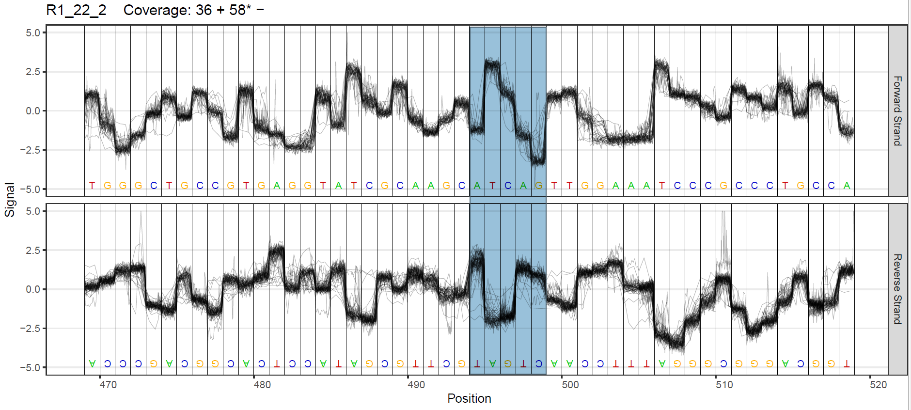
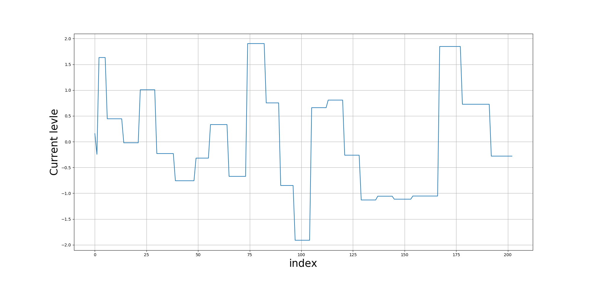
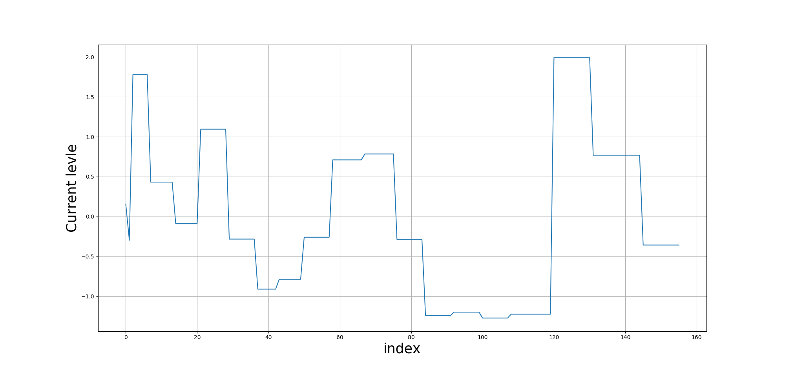

## Introduction
I selected 25 transcripts with depth between 30 ~ 300[^1]. 

[^1]: The upperbound was set in order to reduce the run time.


**There are 25 transcripts and 128 splicing sites in total, the splicing site with bottom 10 accuracy were listed below: **

```{r eval=FALSE, message=FALSE, warning=FALSE, include=FALSE}
library(ggplot2)
library(reshape2)


result = read.csv(file = "/home/ubuntu/PhD_proj/pipeline/Validation/predictions_f15_t4/merge2.csv")
result = result[-19,]
result$accuracy_manhattan = result$manhattan_correct/result$mapped_reads
result$accuracy_z_score = result$z_score_correct/result$mapped_reads
result$accuracy_loglik_score = result$log_correct/result$mapped_reads
result$accuracy_mapper_support   = result$num_of_support/result$mapped_reads
result$accuracy_mapper_support[result$accuracy_mapper_support >1] = 1

result = result[order(result$accuracy_loglik_score),]
print(result[1:10,c("transcript_ID","juncID","accuracy_loglik_score","num_of_candidates","mapped_reads")],row.names = F)

data <- melt(result[c("accuracy_loglik_score", "accuracy_manhattan", "accuracy_z_score")])#
ggplot(data,aes(x=value, fill=variable)) + geom_density(alpha=0.25)

data <- melt(result[c("accuracy_loglik_score", "accuracy_mapper_support")])#"accuracy_manhattan", "accuracy_z_score",


########PLOT1##############
ggplot(data,aes(x=value, fill=variable)) + geom_histogram(alpha = 0.25,position="dodge")   +  theme(plot.title = element_text(hjust = 0.5)) + geom_density(alpha=0.25) # + ggtitle("Accuracy Density ")

data <- melt(data.frame(
                        log_likelihood = (result$log_correct-result$num_of_support)/result$mapped_reads))
                        #manhattan = (result$manhattan_correct-result$num_of_support))/result$mapped_reads)zscore = (result$z_score_correct-result$num_of_support)/result$mapped_reads,

########PLOT2##############
ggplot(data,aes(y=value, x=variable, fill = variable)) +  geom_boxplot(alpha=0.4) + labs(y = '',x = '')
########PLOT3##############


ggplot(result, aes(y = accuracy_loglik_score, x = num_of_candidates)) + geom_point() +  geom_smooth(method=lm,  se = F,linetype="dashed",color="darkred",fill="blue") + ggtitle("Accuracy VS # of candidates") +  theme(plot.title = element_text(hjust = 0.5))
```


## Forward strand Reads (transcript related)

```{r eval=FALSE, warning=FALSE, include=FALSE}
library(ggplot2)
library(reshape2)


result_f = read.csv(file = "~/PhD_proj/pipeline/result_csv2/merge2_f.csv")
dim(result_f)
result_f$accuracy_manhattan = result_f$manhattan_correct/result_f$mapped_reads
result_f$accuracy_z_score = result_f$z_score_correct/result_f$mapped_reads
result_f$accuracy_loglik_score = result_f$log_correct/result_f$mapped_reads

result_f = result_f[order(result_f$accuracy_loglik_score),]
print(result_f[1:10,c("transcript_ID","juncID","accuracy_loglik_score","num_of_candidates","mapped_reads")],row.names = F)

data <- melt(result_f[c("accuracy_loglik_score", "accuracy_manhattan", "accuracy_z_score")])
ggplot(data,aes(x=value, fill=variable)) + geom_density(alpha=0.25)

data <- melt(data.frame(zscore = result_f$z_score_correct-result_f$num_of_support,
                        log_likelihood = result_f$log_correct-result_f$num_of_support,
                        manhattan = result_f$manhattan_correct-result_f$num_of_support))


#ggplot(data,aes(y=value, x=variable, fill = variable)) +  geom_boxplot(alpha=0.4) + labs(y = '# of correct perditions - # of mapping supports',x = '')

ggplot(result_f, aes(y = accuracy_loglik_score, x = num_of_candidates)) + geom_point() +  geom_smooth(method=lm,  se = F,linetype="dashed",color="darkred", fill="blue") + ggtitle("Accuracy VS # of candidates") +  theme(plot.title = element_text(hjust = 0.5))

```

## Reverse strand Reads

```{r eval=FALSE, warning=FALSE, include=FALSE}
library(ggplot2)
library(reshape2)


result_r = read.csv(file = "~/PhD_proj/pipeline/result_csv2/merge2_r.csv")
dim(result_r)
result_r$accuracy_manhattan = result_r$manhattan_correct/result_r$mapped_reads
result_r$accuracy_z_score = result_r$z_score_correct/result_r$mapped_reads
result_r$accuracy_loglik_score = result_r$log_correct/result_r$mapped_reads

result_r = result_r[order(result_r$accuracy_loglik_score),]
print(result_r[1:10,c("transcript_ID","juncID","accuracy_manhattan","num_of_candidates","mapped_reads")],row.names = F)

data <- melt(result_r[c("accuracy_loglik_score", "accuracy_manhattan", "accuracy_z_score")])
ggplot(data,aes(x=value, fill=variable)) + geom_density(alpha=0.25)

data <- melt(data.frame(zscore = result_r$z_score_correct-result_r$num_of_support,
                        log_likelihood = result_r$log_correct-result_r$num_of_support,
                        manhattan = result_r$manhattan_correct-result_r$num_of_support))


#ggplot(data,aes(y=value, x=variable, fill = variable)) +  geom_boxplot(alpha=0.4) + labs(y = '# of correct perditions - # of mapping supports',x = '')

ggplot(result_r, aes(y = accuracy_loglik_score, x = num_of_candidates)) + geom_point() +  geom_smooth(method=lm,  se = F,linetype="dashed",color="darkred", fill="blue") + ggtitle("Accuracy VS # of candidates") +  theme(plot.title = element_text(hjust = 0.5))

```
              
              
## Site position correlation

```{r eval=FALSE, warning=FALSE, include=FALSE}

site_pos = read.csv(file = "~/PhD_proj/pipeline/result_csv2/sites.csv",header = F, col.names = c('junc_start','junc_end'))
strand = read.csv(file = "~/PhD_proj/pipeline/result_csv2/strand.csv",header = F, col.names = "strand")
trans_len = t(read.table(file = "~/PhD_proj/pipeline/result_csv2/trans_len.txt",sep = ','))


result_r = cbind(read.csv(file = "~/PhD_proj/pipeline/result_csv2/merge2_r.csv",header = T), site_pos, strand)
result_f = cbind(read.csv(file = "~/PhD_proj/pipeline/result_csv2/merge2_f.csv", header = T), site_pos, strand)

result_r$accuracy_manhattan = result_r$manhattan_correct/result_r$mapped_reads
result_r$accuracy_z_score = result_r$z_score_correct/result_r$mapped_reads
result_r$accuracy_loglik_score = result_r$log_correct/result_r$mapped_reads
result_r$trans_len = result_r$junc_start/trans_len


result_f$accuracy_manhattan = result_f$manhattan_correct/result_f$mapped_reads
result_f$accuracy_z_score = result_f$z_score_correct/result_f$mapped_reads
result_f$accuracy_loglik_score = result_f$log_correct/result_f$mapped_reads
result_f$trans_len = result_f$junc_start/trans_len


genome_f = rbind(result_f[strand == '+',], result_r[strand == '-',])
genome_r = rbind(result_f[strand == '-',], result_r[strand == '+',])

#genome_f = rbind(result_f[strand == '+',], result_r[strand == '+',])
#genome_r = rbind(result_f[strand == '-',], result_r[strand == '-',])

temp = rbind(genome_f,genome_r)
#ggplot(genome_r, aes(y = accuracy_loglik_score, x = trans_len)) + geom_point() +  geom_smooth(method=lm,  se = F,linetype="dashed",color="darkred", fill="blue")


#ggplot(genome_f, aes(y = accuracy_loglik_score, x = trans_len)) + geom_point() +  geom_smooth(method=lm,  se = F,linetype="dashed",color="darkred", fill="blue")

ggplot(temp, aes(y = accuracy_loglik_score, x = trans_len)) + geom_point() +  geom_smooth(method=lm,  se = F,linetype="dashed",color="darkred", fill="blue")

ggplot(temp, aes(y = accuracy_loglik_score, x = junc_start)) + geom_point() +  geom_smooth(method=lm,  se = F,linetype="dashed",color="darkred", fill="blue")

```


## Mean method
```{r load result, eval=FALSE, warning=FALSE, include=FALSE}
library(ggplot2)
library(reshape2)


result_mean = read.csv(file = "~/PhD_proj/pipeline/result_mean/merge_mean.csv")
result_mean$accuracy_manhattan = result_mean$manhattan_correct/result_mean$mapped_reads
result_mean$accuracy_z_score = result_mean$z_score_correct/result_mean$mapped_reads
result_mean$accuracy_loglik_score = result_mean$log_correct/result_mean$mapped_reads

result_mean = result_mean[order(result_mean$accuracy_loglik_score),]
print(result_mean[1:10,c("transcript_ID","juncID","accuracy_manhattan","num_of_candidates","mapped_reads")],row.names = F)

data <- melt(result_mean[c("accuracy_loglik_score", "accuracy_manhattan", "accuracy_z_score")])
ggplot(data,aes(x=value, fill=variable)) + geom_density(alpha=0.25)

data <- melt(data.frame(zscore = result_mean$z_score_correct-result_mean$num_of_support,
                        log_likelihood = result_mean$log_correct-result_mean$num_of_support,
                        manhattan = result_mean$manhattan_correct-result_mean$num_of_support))


#ggplot(data,aes(y=value, x=variable, fill = variable)) +  geom_boxplot(alpha=0.4) + labs(y = '# of correct perditions - # of mapping supports',x = '')

ggplot(result_mean, aes(y = accuracy_loglik_score, x = num_of_candidates)) + geom_point() +  geom_smooth(method=lm,  se = F,linetype="dashed",color="darkred", fill="blue")

```

## mean vs max
```{r eval=FALSE, warning=FALSE, include=FALSE}
library(ggplot2)
library(reshape2)


result_old = read.csv(file = "~/PhD_proj/pipeline/result_csv/merge.csv")
dim(result_old)
result_old$accuracy_manhattan = result_old$manhattan_correct/result_old$mapped_reads
result_old$accuracy_z_score = result_old$z_score_correct/result_old$mapped_reads
result_old$accuracy_loglik_score = result_old$log_correct/result_old$mapped_reads

result_old = subset(result_old, transcript_ID != "R2_60_2")
result_old = subset(result_old, transcript_ID != "R1_91_2")

data <- melt(data.frame(new_version=result$accuracy_loglik_score, old_version=result_old$accuracy_loglik_score))#mean_log_likelihood = result_mean$accuracy_loglik_score,

mean1 = mean(result$accuracy_loglik_score)
mean2 = mean(result_old$accuracy_loglik_score)
ggplot(data,aes(x=value, fill=variable)) + geom_density(alpha=0.25)
ggplot(data,aes(y=value, fill=variable)) + geom_boxplot(alpha=0.25) 
```
## new vs old
```{r eval=FALSE, warning=FALSE, include=FALSE}
library(ggplot2)
library(reshape2)


result_old = read.csv(file = "~/PhD_proj/pipeline/result_mean/merge_mean.csv")
dim(result_old)
result_old$accuracy_manhattan = result_old$manhattan_correct/result_old$mapped_reads
result_old$accuracy_z_score = result_old$z_score_correct/result_old$mapped_reads
result_old$accuracy_loglik_score = result_old$log_correct/result_old$mapped_reads

result_old = subset(result_old, transcript_ID != "R2_60_2")
result_old = subset(result_old, transcript_ID != "R1_91_2")

data <- melt(data.frame(sum_version=result$accuracy_loglik_score, mean_version=result_old$accuracy_loglik_score))#mean_log_likelihood = result_mean$accuracy_loglik_score,

mean(result$accuracy_loglik_score)
mean(result_old$accuracy_loglik_score)
ggplot(data,aes(x=value, fill=variable)) + geom_density(alpha=0.25)
ggplot(data,aes(y=value, fill=variable)) + geom_boxplot(alpha=0.25) 
```


## Distance distribution


```{r}
library(ggplot2)
library(reshape2)

#load file
ncol = 50
#score_f15_t4 = read.csv(file = "~/PhD_proj/pipeline/Validation/score_f15_t4_merge.csv",header = F,col.names = seq(1, ncol))

score_f15_t4 = read.csv(file = "~/PhD_proj/pipeline/Validation/merge_f15_t4_mad.csv",header = F,col.names = seq(1, ncol))
while(sum(is.numeric(score_f15_t4$X1)) > 0 || sum(is.na(score_f15_t4$X1))) {
  ncol = ncol + 10
  score_f15_t4 = read.csv(file = "~/PhD_proj/pipeline/Validation/score_f15_t4_merge.csv",header = F,col.names = seq(1, ncol))
}


# fast5 filenames
  filenames = score_f15_t4$X1
  #junctionID = c(1)
  #for (i in 8900:length(filenames)){
  #  if (filenames[i] == filenames[i-1]){
  #    junctionID[i] = junctionID[i-1] + 1
  #  }else{
  #    junctionID[i] = 1
  #  }
  #}


# likelihood_score (single candidate junctions removed)
likelihood_score = cbind(filenames, score_f15_t4[,seq(4,ncol,3)])
likelihood_score = likelihood_score[!is.na(likelihood_score$X4),]
has_multi_candidates = apply(likelihood_score[,-1],1,function(x) sum(!is.na(x)) > 1)
likelihood_score = likelihood_score[has_multi_candidates,]

#v = as.vector(as.matrix(score_f15_t4[,seq(5,ncol,3)]))
#hist(v)
#which(likelihood_score[,-1] > 15)

# distance of best matched candidate
min_dist = apply(likelihood_score[,-1],1,function(x) min(x, na.rm=T))
# bool that the corresponding prodiction is correct or not
correctness = apply(likelihood_score[,-1],1,which.min) == 1
print("Accuracy:")
print(sum(correctness)/length(correctness))


data <- data.frame(likelihood_score,min_dist = min_dist, correctness = correctness)

# distribution of min dist (box plot)
ggplot(data,aes(y=min_dist, fill=correctness)) + geom_boxplot(alpha=0.25) 

# distribution of min dist (density plot)
ggplot(data,aes(x=min_dist, fill=correctness)) + geom_histogram(aes(y=..count../sum(..count..)),alpha = 1,position="dodge") + geom_density(alpha=0.1)


#threshold accuraccy plot    
    #l=c()
    #y=c()
    #x=seq(0,10,0.01)
    #for (i in x){
    #  correctness_filtered = correctness[min_dist<i]
    #  y = c(y,sum(correctness_filtered==1)/length(correctness_filtered))
    #  l=c(l, length(correctness_filtered)/length(correctness))
    #}
    #
    #ggplot() + geom_line(aes(x,l)) + geom_line(aes(x,y))
    

true_reads = likelihood_score[correctness == T,]
false_reads = likelihood_score[correctness == F,]

true_reads_dist = apply(true_reads[,-1],1,function(x) min(x, na.rm = T))
false_reads_dist = apply(false_reads[,-1],1,function(x) min(x, na.rm = T))


false_diff = apply(false_reads[,-1],1,function(x) abs(min(x, na.rm=T) - x[1]))
#false_diff = apply(false_reads[,-1],1,function(x) abs(min(x, na.rm=T) - x[order(x)[2]]))
true_diff = apply(true_reads[,-1],1,function(x) abs(x[1] - x[order(x)[2]]))

ggplot() + geom_point(aes(x=true_reads_dist,y=true_diff,color = "true"),size = 0.01,alpha = 0.2) + geom_point(aes(x=false_reads_dist,y=false_diff,color = "false"),size = 0.01,alpha = 0.4) + geom_density_2d(aes(x=true_reads_dist,y=true_diff,fill = "true",color = "true")) + geom_density_2d(aes(x=false_reads_dist,y=false_diff,fill = "false",color = "false")) + xlab("hardness of matching (distance)")+ ylab("confidence (difference of distance)")+scale_color_manual("Legend",values = c("blue","red")) + ylim(0,4) + xlim(1,6)


#ggplot() + geom_point(aes(x=false_reads_dist,y=false_diff,fill = "false",color = "red"),size=0.1) + geom_density_2d(aes(x=false_reads_dist,y=false_diff,fill = "false",color = "false")) + xlab("hardness of matching (distance)")+ ylab("confidence (difference of distance)")+scale_color_manual("Legend",values = c("blue","red")) 


ggplot() + geom_density(aes(x = false_diff,fill = "false"), alpha = 0.3)  + geom_density(aes(x = true_diff, fill = "true"), alpha = 0.3) + xlab("Difference of distance") + scale_color_manual("Legend",values = c("red","blue"),aesthetics = "fill")

  #stat_density_2d(geom = "polygon", aes(x=true_reads_dist,y=true_diff,alpha = ..level.., fill = "true")) + 
  #stat_density_2d(geom = "polygon", aes(x=false_reads_dist,y=false_diff,alpha = 3/10*..level.., fill = "false"))

```

```{r high diff but low dist}
which(false_diff>0.7 & false_reads_dist < 2.2)
```


## Distance distribution (mean) 
```{r}
library(ggplot2)
library(reshape2)


score_f15_t4_mean = read.csv(file = "~/PhD_proj/pipeline/Validation/score_f15_t4_mean_merge.csv",header = F)

ncol = dim(score_f15_t4_mean)[2]
likelihood_score_mean = score_f15_t4_mean[,seq(5,ncol,3)]
likelihood_score_mean = likelihood_score_mean[!is.na(likelihood_score_mean$V5),]
has_multi_candidates = apply(likelihood_score_mean,1,function(x) sum(!is.na(x)) > 1)
likelihood_score_mean = likelihood_score_mean[has_multi_candidates,]

min_dist = apply(likelihood_score_mean,1,function(x) min(x, na.rm=T))
correctness_mean = apply(likelihood_score_mean,1,which.min) == 1

data <- data.frame(min_dist = min_dist, correctness_mean = correctness_mean)
ggplot(data,aes(y=min_dist, fill=correctness_mean)) + geom_boxplot(alpha=0.25) 

ggplot(data,aes(x=min_dist, fill=correctness_mean)) + geom_histogram(aes(y=..count../sum(..count..)),alpha = 1,position="dodge") + geom_density(alpha=0.1)

l=c()
y=c()
x=seq(0,10,0.01)
for (i in x){
  correctness_filtered = correctness_mean[min_dist<i]
  y = c(y,sum(correctness_filtered==1)/length(correctness_filtered))
  l=c(l, length(correctness_filtered)/length(correctness_mean))
}

ggplot() + geom_line(aes(x,l)) + geom_line(aes(x,y))

y[length(y)]
length(correctness_mean)


true_reads = likelihood_score_mean[correctness_mean == T,]
false_reads = likelihood_score_mean[correctness_mean == F,]

true_reads_dist = apply(true_reads,1,function(x) min(x, na.rm = T))
false_reads_dist = apply(false_reads,1,function(x) min(x, na.rm = T))


false_diff = apply(false_reads,1,function(x) abs(min(x, na.rm=T) - x[1]))
true_diff = apply(true_reads,1,function(x) abs(x[1] - x[order(x)[2]]))

ggplot() + geom_density_2d(aes(x=true_reads_dist,y=true_diff)) + geom_density_2d(aes(x=false_reads_dist,y=false_diff), color = "red")

ggplot() + geom_density(aes(x = false_diff), fill = "red", alpha = 0.3)  + geom_density(aes(x = true_diff), fill = "blue", alpha = 0.3) + xlab("hardness of matching") + ylab("confidence")


```

## Distance distribution (mean vs sum)
```{r}
color = c()
for (i in 1:length(correctness_mean)){
  if ( correctness_mean[i] == T && correctness[i] == F) {color = c(color,'red')}
  else{color = c(color,'black')}
}

b = correctness == F
a = correctness_mean == T
plot(likelihood_score[a*b==1,1],likelihood_score_mean[a*b==1,1],col = "red")
b = correctness == T
a = correctness_mean == F
points(likelihood_score[a*b==1,1],likelihood_score_mean[a*b==1,1],col = "blue")
abline(1,1)

#test_index = apply(likelihood_score_mean,1,which.min) == apply(likelihood_score,1,which.min)

#test = likelihood_score[test_index,]

#correctness_test = apply(test,1,which.min) == 1
```


## Single site inspection

R2_26_1 junction 6 has lowest accuracy, but it has 9 candidates. The correlation between the number of accracy and the accuraccy will be investigated **later**. I will start with **R1_22_2 junction 2** , which has only 2 candidates but perform really bad in characterisation.


### R1_22_2 junction 2

#### **splicing site information**
```{bash}
pipeline_dir=/home/ubuntu/PhD_proj/pipeline/
echo Candidate Information:
cat $pipeline_dir/Candidates/README.txt
sed -n '2p' $pipeline_dir/Candidates/R1_22_2_candidate.txt
echo transcript BED format
grep R1_22_2 $pipeline_dir/BED/annotation.bed
```

The transcript is in **reverse** strand with length 1037, the corresponding location in transcript is 479~504[^2]

[^2]: 1037 - 558, 1037 - 533

#### **Plot reads and Candidates**

```{bash eval=FALSE, include=FALSE}
singularity exec ~/wflow_container tombo plot genome_locations --fast5-basedirs ~/data/2018_01_17_SHSY5Y_cDNA_bcode_test/2018.01.17_SHSY5Y_cDNA_bcode_test --genome-locations R1_22_2:494 --num-bases 30 --pdf-filename ~/temp.pdf

```
<center>
Tombo plot **The highlighted part is the difference between candidates**
<conter/>



```{bash eval=FALSE, include=FALSE}
python3 ~/PhD_proj/Python/visulisation/plot_scrappie_model.py <seq> <filename>
```

<div class="column-left">

<center>

{width=99%}

<center/>


</div>

<div class="column-right">


<center>


{width=99%}

<center/>


</div>


