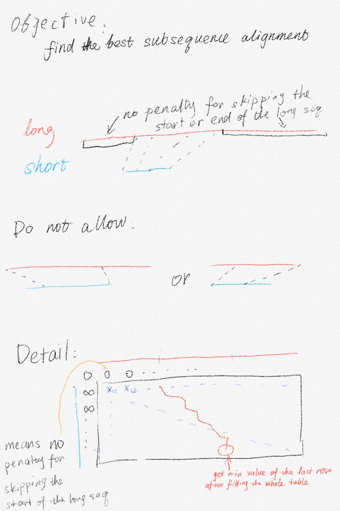
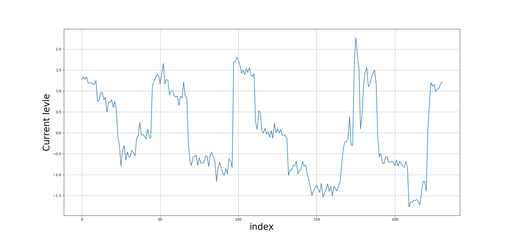
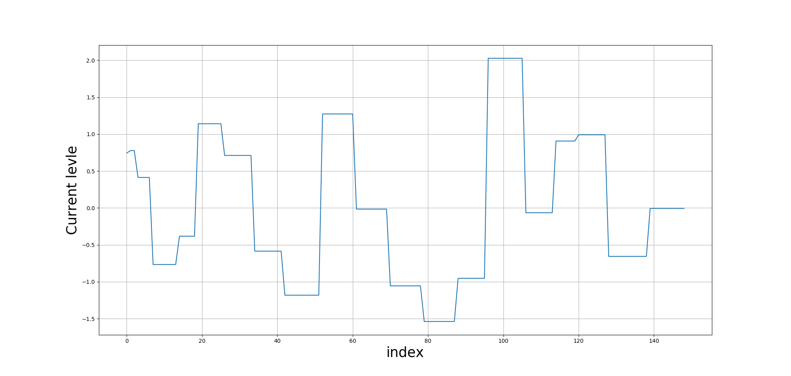
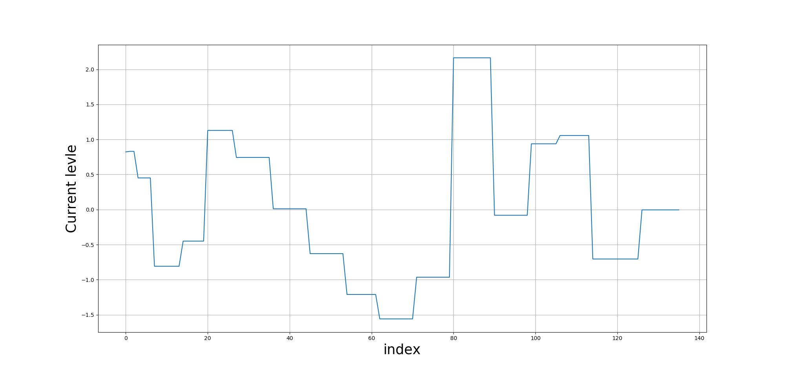
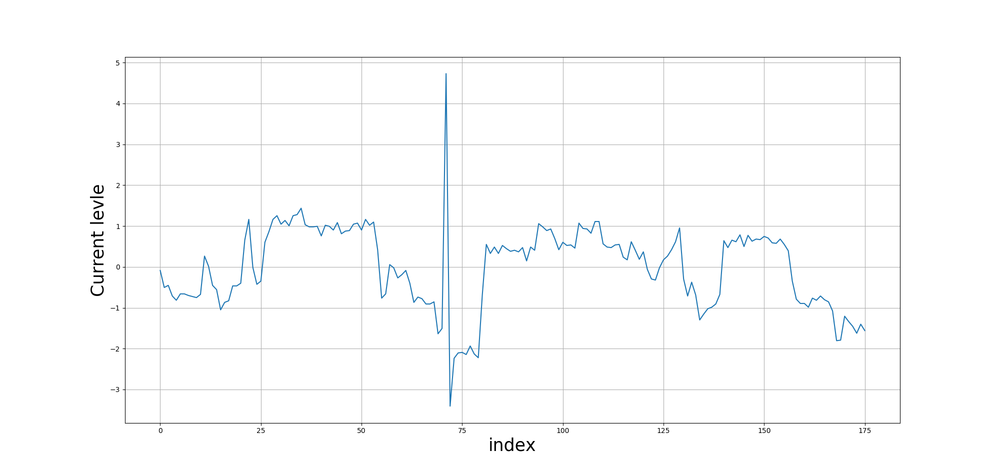
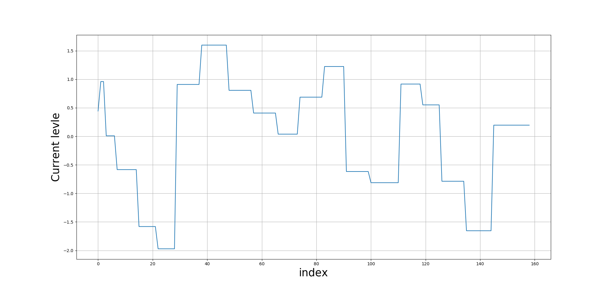
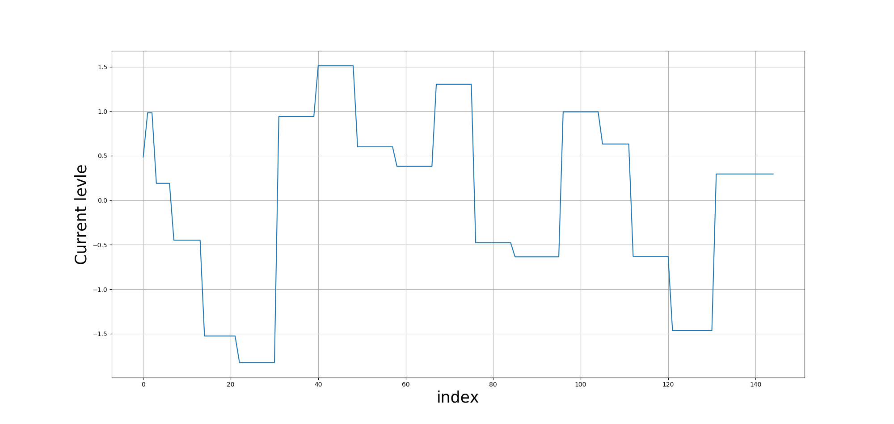
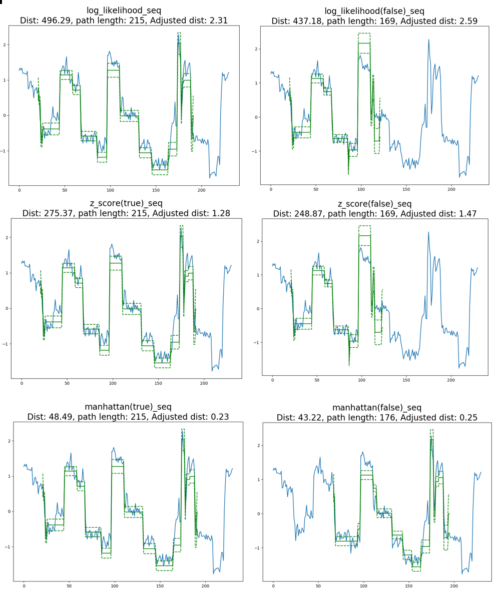
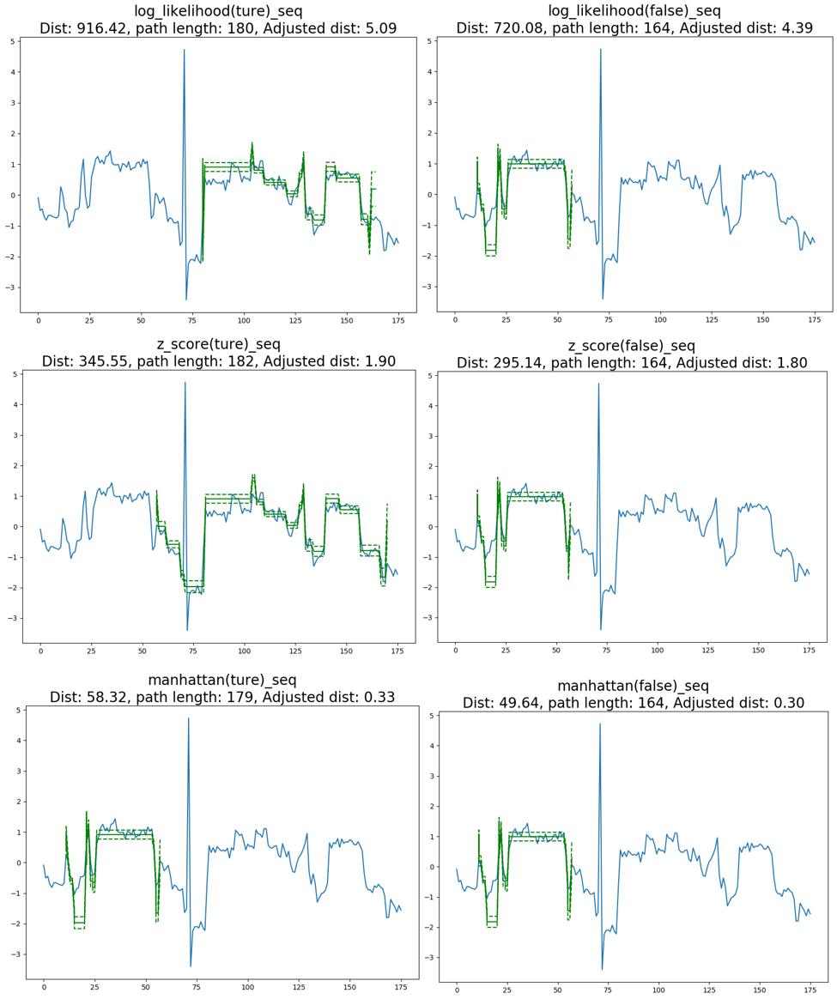

In order to modify the algorithm flexibly, I developed the DTW by my self. The code is on [http://github.com/youyupei/Nanopore-Splicing-Site](http://github.com/youyupei/Nanopore-Splicing-Site)

## Normalisation

I have tried two nomalization methods:

*z-score
*median shift(default)

I can not tell the different by just looking at the visualised alignment

## Distance metrics

I have tried different score in DTW:

* Manhattan
* z-score
* -log(dnorm(mean, std))

By visual checking, **Manhattan, loglikelihood** returned reasonable result. Intuitively, the loglikelihood is the best one since it is easier to be interpreted.

## Implementation 

{width=60%}

## Alignment output

Code for ploting the alignment: [plot_dtw_alignment.py](https://github.com/youyupei/Nanopore-Splicing-Site/blob/master/visulisation/plot_dtw_alignment.py)

### Queried Reads and Candidate models

The queried reads and splicing site have been described in [Single splicing site and tested reads](cDNA_R1_102_1.html) In the following figure, the true or simulated signals are expected to come from the 20 bases around the queried splicing site **(TCCGGCCAGTGGAATCTTGG)** [^1].

[^1]: For the queried reads, we locate the corresponding signal by referring to the tombo output. The models were directly generated from the candidates exon junction sequence.

#### True read

{width=70%}

{width=99%}

{width=99%}

 

 

#### False read

{width=70%}

{width=99%}

{width=99%}

### Alignment

#### True read result:

#### False read result:

