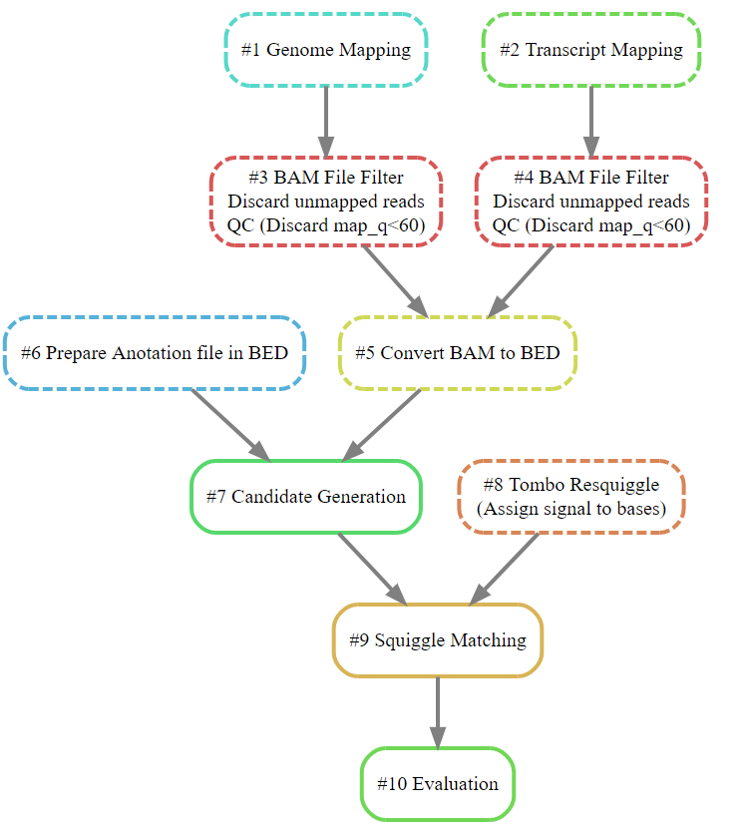

## Introduction

To test the accuracy of the Squiggle match method, and make the further investigation more convenient, I wrote a snakemake pipeline to run the test across whole sequins genome. **Currently the pipeline can only handle the spike-ins with known splicing site and transcript reference.**

## Pipeline

{width=60%}

### Input data and software

  This pipeline can only deal with Nanopore cDNA data. **Some modification needed if the dataset comes from directRNA [^1].** 
  
  * Data:
    1. basecalled fastq files
    2. sequence summary file
    3. raw fast5 file
    4. spike-in genome reference
    5. spike-in transcript referece
    6. spike-in transcript gtf file
    
  * Software:
    All the require the software is in a container (use singualrity 2.5.2-dist):
      1. snakemake 5.5.2
      2. minimap2 2.17-r943-dirty (with paftools.js)
      3. Tombo v1.5
      4. scrappie (python package scrappy v1.4.1)
  
  [^1]: The raw signal direct is 3' to 5' for directRNA Nanopore sequencing (which is 5' to 3' for DNA/cDNA).    
  
### Pipeline steps explaination

  * \#1 and \#2: 
    * **map fastq to spike-in genome reference (\#1) and spike-in transcript referece (\#2)**
    * output: bam files for each reference
  * \#3: **filter out unmapped and low mapping quality (<60[^2]) reads.** (output: filtered bam)
  * \#4: **generate bed file for each transcript**
    * input1: genome_map.bam, for getting the junctions' genome location for each read
    * input2: transcript_map.bam, for grouping the reads by transcripts
  * \#5: **convert gtf file to bed file**
  * \#6: [**Generate candidate files**](candidate_generator.html)
  * \#7: **Data proprocessing for tombo**
    * Tombo requires fastq information, this step put fastq inside the fast5 file.
  * \#8: **Tombo resquiggle**: assign raw signal in fast5 to the spike-in transcript referece.
  * \#9: **Get a score for each candidate**
    1. get candidates for each splicing site from \#6
    2. simulate squiggle using scrappie for each candidates
    3. get junction signal from \#8
    4. run dtw between junction signal and simulated signal. Get a score for each candidate.

  

  
  
[^2]: 60 is the max mapping quality in minimap2 which indicates unique map.

