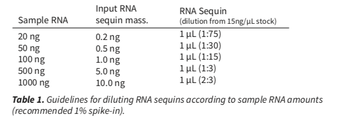
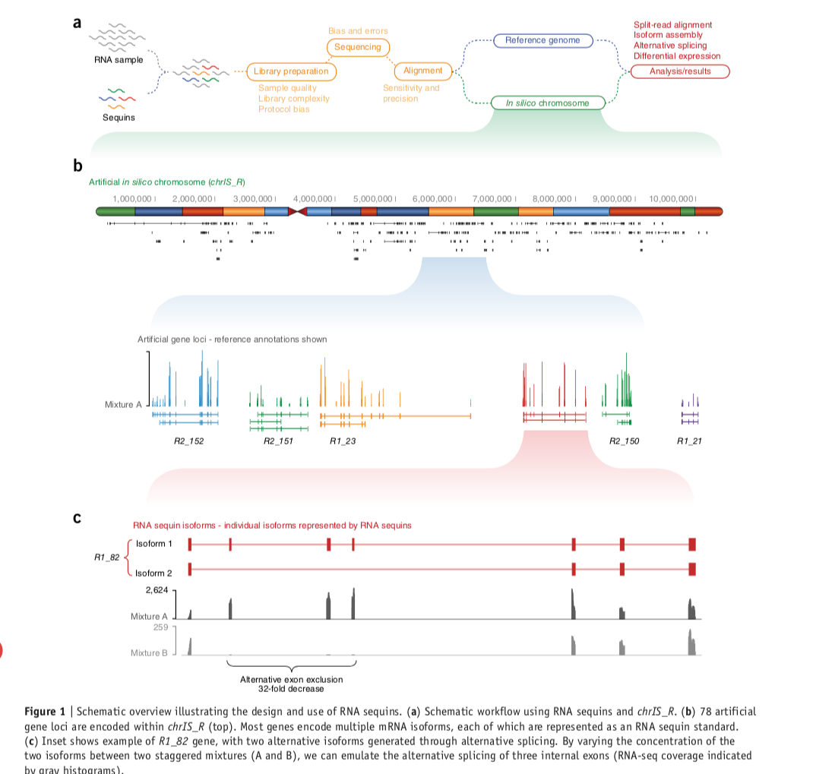
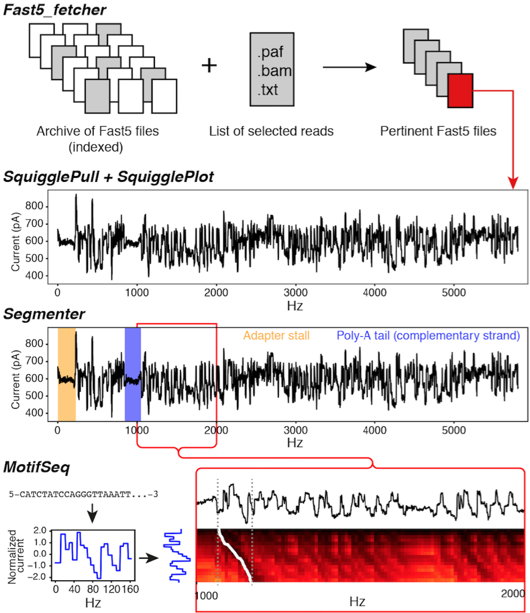
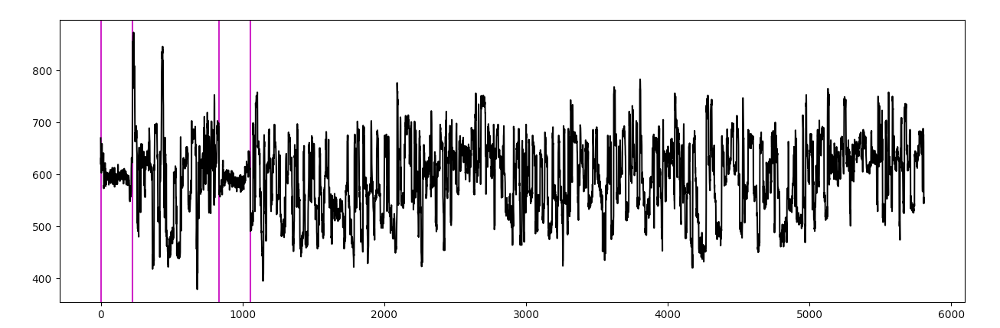
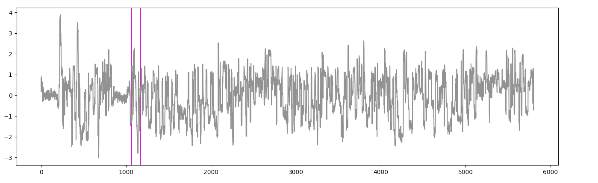
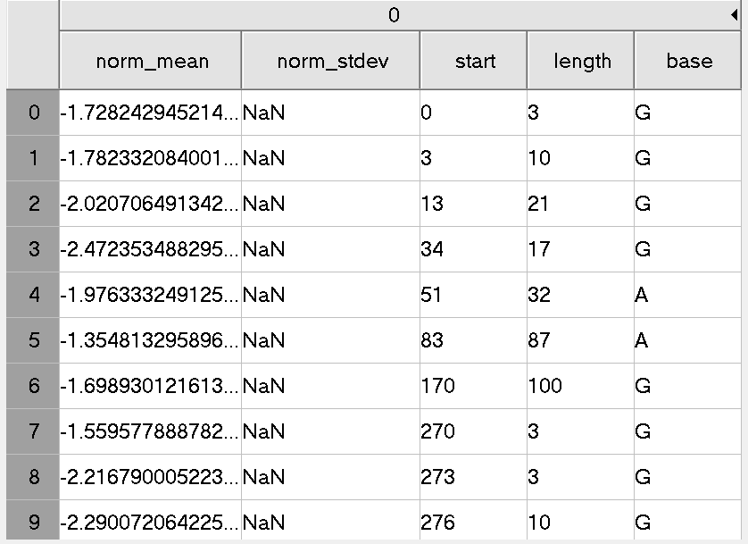

```{r setup, include=FALSE}
knitr::opts_chunk$set(echo = TRUE)
```

# Meeting

## Tue 5 Mar 2019: project description (with Heejung and Mike)

### Topic 

First step of PhD project

### Objective 

Find the exact splicing site using Oxford Nanopore data.
  
### Motivation

The Oxford nanopore sequence data have advantages in analysing mRNA because of its nature of long read. However, the main limitation of this technology is its high error rate (mostly small deletion), which hindered the accurate identification of splicing site. Errors near the splicing will dramatically affect the functional analysis of the given mRNA. Therefore, an accurate method for identifying the exact splicing site is very desirable.
  
### Approach

We are not going to apply any base caller but the raw data (squiggle) since the high error rate of current base callers. The squiggle is believed to have more information and has been used in some current studies (e.g. identifying barcode). The potential sequences of splicing site could be inferred given the sequenced region we are interested in. We need to construct the squiggle patterns of those potential splicing sites and looking for a match within the region we interest in [^Question1].  Note that a match allows horizontal or vertical scaling of the squiggle, which may be induced by the different speed that the sequenced molecule traverse through the pore. The speed is affected by the ATP concentration. An appropriate approach might be dynamic time warping (DTW). In the end, we need to output the probabilities of each potential splicing site is the correct one.

[^Question1]: How and how complete?

### Things to do next

* Read paper about DTW and talk with Heejung on 1 pm next Thursday (13 Mar 2019)
* Reproduce some examples in SquiggleKit or use data from Mike.
* Mike's talk (Friday 4 pm)


## Mon 18 Mar 2019:Ideas about the direction at the start of the project

### Introduction

After talked with Heejung and Mike, there are a couple ideas that worth to be tried.
The project is going to follow the steps listed below:

1. Determine the candidate spicing sites and motifs.
  + We will firstly focus on the canonical splicing site. Because most of the splicing happen at those sites.
  + For all the combinations of potential splicing sites in concern, list all the motifs that could be the joints between exons.
2. **Generate representitive squiggle for each of the motifs.**
3. Squiggle matching. (DTW)

### Generate representitive squiggle for each of the motifs

The main discussion of the meeting were on how to generate a representitive squiggle for a given genomic sequence. Some ideas have come out and worth to be tried:

#### Method 1: Generate the squiggle directly from the pore model{#Generate}

Oxford Nanopore Technology (ONT) provides pore models for their sequencer, which were trained by the company. The model describes the expected cureent signal for each k-mer with its variance. `Scrappie squiggle` is a possible program developed by ONT and does the squiggle simulation. 

**Problems: Currently, it seems that there isn't any RNA model. The available options are "raw_r94", "rgrgr_r94", "rgrgr_r941", "rgrgr_r10", "rnnrf_r94".**

(4/8/2019 updated: RNA model is now available)

#### Method 2: Get Model from spink-ins

Spike-in provides ground truth of the underlying genomic sequence. Hopefully, the spike-ins contain the motifs in interest. The idea is to find the corresponding signal data to the candidate motifs. 

There are two methods found to match/align the events of squiggle to the ref genome: `nanopolish eventalign` and `tombo resquiggle`. Both of them treat the raw data as a series of events.

1. Use the method in \@ref(Generate), we can simulate squiggles for given motifs
      + However, the simulated squiggle may bia to the model provided by ONT. 

2. Match the simulated squiggle to the spike-ins:
      + We know the exactly sequences of spike-ins so the exactly number of occurances of each k-mer.
      + We know the exon in spike-ins, so that we can narrow down the searching area to the splicing sites.
  
3. Use the matched squiggles from spike-ins to construct a representative squiggle for a motif in interest.


## Wed 10 Apr 2019: Progress Update

### Did

1. All fastq reads were mapped by minimap2 to Sequins (Spike-in) isoforms and Spike-in reads were collected.
2. All fast5 reads (raw data) were indexed from read IDs, so that fastq read and fast5 read can be paired.
3. Squiggle can be assigned to each nucleotide base using Tombo, so that we can collect squiggles for a given motif, once it appears in the spike-in sequence.


### Going to do

* Statistics of current level to check whether or not the average level will vary in differet channel or different time in a same channel
* Play with the spike-in reads: 
	1. Separate spike-in reads into training set and validation set (validation set comes from the different isoform with the training set).
	2. For validation set, randomly pick some exon boundary and infer the potential motifs from mapped spike-in reads.
	3. Check the number of occurrences of the motifs in the training set, tune the length of motifs to guarantee enough number of occurrences. 
	4. Clip out squiggles from motifs as well as the squiggles from corresponding exon boundary in validation set by using Tombo.
	6. Try to use DTW to match the squiggles

Other things talked today:  

  1. Perhaps Mike could add me and Heejung to his group in ONT community.
  2. Clarification about how to determine potential exon boundaries
      + Method : Regard all the splited read boundaries as the potential boundaries.


# Reading

## Real-time selective sequencing using nanopore technology

### Objective:
Select subset of DNA from a pool of molecules for sequencing with minimal specialized library preparation based on the identity of an initial set of sequenced bases.(Software: Read Until).

### Motivation:
* Current sequencing methods can result in unnecessary sequencing. 
* The ratio of interested region can not be modified after library preparation is complete.
* The problem of ratios cannot be detected during sequencing.

### Advantage of Nanopore seq
* the voltage across the pore could be reversed so that reject the individual DNA molecules to be seqenced
* Reads that are rejected are unlikely to be sequenced again [^1]

[^1]: The motor protein will have already migrated along the DNA and will not be available to slow the translocation of DNA through the pore. 

### Approach: matching squiggle 
Compare bases to a reference may have problems that the real-time basecalling implimentations are currently to slow and need subsequent optimiztions th improve quaulity.

The matching of two squiggles is complicated, including voltage changes, noise and interactions between channels. These behaviors are captured by shift, scale and drift.z-score normalization can be used to overcome shift and scale. However drift is insignificant in short nanopore traces, 

#### Generate squiggle from nucleotide sequence.

To do squiggle matching, the reference sequences have to been converted to squiggles. For each k-mer in the reference, the expected mean current value from the model file is calculated as squiggle value.

**Figure S2: Top row is a simulation of shift, acle and drift. Bottem row is Z-score normalised.**

#### Dynamic time warping (DTW)

DTW is guaranteed to find the optimal alignment of two series of **time-ordered** data, which has been used in the analysis of sequence data. The naive DTW has O(m\*n), where m is reference length and n is query length. The speed of match by DTW is constrained by m. In theory, DTW can be applied to genomes up to 5 Mb in length. It's main idea is to find best possible alignment between two time series rather than use just some distances and is able to **ignore shifts in time dimention.**

An explaination of DTW see: [https://www.youtube.com/watch?v=tfOevFKQIjQ](https://www.youtube.com/watch?v=tfOevFKQIjQ)

There are some points to be noted:

* DTW treats the squiggle as a serie of discrete points
* A range of distance metrics are available. (Euclidean, absolute, Manhattan distance...)
* A cost Matrix(C) need to be predefined for the lowest cost of moving. C[i,j] = min(C[i-1,j],C[i,j-1],C[i-1,j-1]+D[i,j])

* The complexity is O(m\*n)

##### An inportance variation of DTW for sub-sequence alignment is termed subsequence DTW (sDTW) 

Variation: row C[0,1..n] is initialised the same as D[0,1..n].

## Using sequins with RNA sequencing
### Introduction

This is a summary of lab protocol and data analyses of using spike-ins with RNA sequecing. Original pdf: [https://s3.amazonaws.com/sequins/website/rna_resources/Sequin_Protocol_RNAseq_4.3.pdf](https://s3.amazonaws.com/sequins/website/rna_resources/Sequin_Protocol_RNAseq_4.3.pdf)
And the paper: [spliced synthetic genes as internal controls in rNA sequencing experiments](https://www-nature-com.ezp.lib.unimelb.edu.au/articles/nmeth.3958.pdf)

### Protocol 

#### Dilute to target concentration

#### Spike into RNA sample
  + Added prior to processing steps (e.g. poly-A enrichment or rRNA depletion).
  + Two mixture formulations-Mix A and B (same transcripts but different molar ratios) thereby emulating fold-change differences in gene expression and alternative splicing between the two mixtures.
  + A and B are alternatively added but do not add both in a single sample

#### Library preparation and sequencing (Not relavant)

### Sequin analysis

+ Sequins repsent full-length apliced mRNA isoforms. 
+ Entirely artificial with no homology to natural reference genomes.
+ Combination of multiple sequins across concentrations emulates alternative splicing differential gene expression.
+ Provides scaling factors for noirmalization betwwen samples

#### Motivation:
+ Accurate resolution of gene expression is confounded by the sheer size complexity of the transcriptome.
+ Technical variables during library preparation, sequencing and bioinformatic analysis.

#### Analyses:



+ Entirely exogenous RNA modelcule
+ the spike-ins undergo identical procedure so that the error distributions and normalized coverages are similar. (Assess isoform assembly)
+ Compare the expected fold-change between Mix A and B with the observation(scaler for DE)

# Software

## SquiggleKit

### Introduction

SquiggleKit is a tool for handling raw nanopore data, from which extra information beside teh called bases could be mined.SquiggleKit is for managing the extensive number of data files,
extracting signal data, plotting, and examples of processing the noisy raw signal data.
SquiggleKit also acts as a simple guide and starting point for developing new tools which
utilise nanopore signal data. More details is in [SquiggleKit Docs](https://psy-fer.github.io/SquiggleKitDocs/files/).

### Overview

|                                    Tool                                   |                  Description                 |
|:-------------------------------------------------------------------------:|:--------------------------------------------:|
| [Fast5_fetcher](https://psy-fer.github.io/SquiggleKitDocs/fast5_fetcher/) |    Fetched fast5 files from filtered list    |
|  [SquigglePull](https://psy-fer.github.io/SquiggleKitDocs/SquigglePull/)  |            From `.fast5` to `.tsv`           |
|  [SquigglePlot](https://psy-fer.github.io/SquiggleKitDocs/SquigglePlot/)  |          Visualise reads (`.fast5`)          |
|     [Segmenter](https://psy-fer.github.io/SquiggleKitDocs/segmenter/)     | Finds adapter stall, and homopolymer regions |
|      [MotifSeq](https://psy-fer.github.io/SquiggleKitDocs/MotifSeq/)      |  Finds nucleotide sequence motifs in signal  |


### Example run using SquiggleKit 

This is an example from original paper: [SquiggleKit: A toolkit for manipulating nanopore signal data](https://www.biorxiv.org/content/10.1101/549741v1). The objective is to find the 3' end from the squiggle data.



#### Step 1: fast5_fetcher

The fast5 files are usually zipped in a single file (`example_fast5s.tar` in this example, 60 reads inside).

In order to use fast5_fetcher, the `.fast5` files inside the `.tar` file, we need firstly index the `.fast5` files without unpacking the `.tar` file:

We will get a file named `name.index.gz` by running following commend:

```{bash, eval=FALSE}
for file in example/example_fast5s.tar ; do echo $file; tar -tf $file; done >> example/name.index

gzip example/name.index
```

Next, we will fetch 10 reads belong to *R2_151* by using a filter file `filtered_R2_151.paf`. A sequence summary file (`test_seq_sum.txt`) is required.
```{bash, eval = F}
python fast5_fetcher.py -p example/filtered_R2_151.paf -s example/test_seq_sum.txt.gz -i example/name.index.gz -o example/fetched_fast5s
```
Folder `fetched_fast5s/` with fetched reads will be generated.

#### Step 2: Extract signal data from fast5s using SquigglePull and SquigglePlot
The signal information in `.fast5` reads can be either extracted to `.tsv` by SquigglePull or visualized by SquigglePlot:

```{bash, eval = F}
python SquigglePull.py -rv -p example/fetched_fast5s -f all > example/signal.tsv
```
or
```{bash, eval = F}
python SquigglePlot.py -p example/fetched_fast5s
```

#### Step 3: Segment and stall detection

The 3' end should appears near the start of the reads. The `segment.py` is able to detect the stall and return the location.

```{bash, eval = F}
python segmenter.py -s example/signal.tsv.gz -ku -v > example/signals_stall_segments.tsv
```

Match the model from 3’ end of isoform A, which is converted into normalized signal space
```{bash, eval = F}
python MotifSeq.py -s example/signal.tsv.gz --segs example/signals_stall_segments.tsv -m example/CATCTATCCAGGGTTAAATT.model -v
```


## Tombo resquiggle Algorithm

### Introduction

Tombo is primarily for identification of modifications from nanopore data. Here, I document the algorithm of `Tombo resquiggle`, which can be used to align squiggle to genomic sequence.

### Tombo resquiggle Algorithm:
**Note:** This is just brief summary, for more detial, go to [https://nanoporetech.github.io/tombo/resquiggle.html](https://nanoporetech.github.io/tombo/resquiggle.html)

#### Step 1, Genome mapping.
  + via `minimap2`

#### Step 2, Nomalisation.
  The raw signal is normailized using median shift and MAD [^1] scale parameters:
  $$ NormSignal = \frac{RawSignal-Shift}{Scale}$$
  + For RNA, the end of each read is trimmed, so that the adaptor does not affect normalization parameter estimation.

#### Step 3, Event Detection
Event are determined by identifying large shifts in current level. By large shiftes it means the largest junp (most significant in t-test for RNA) between neighboure windows whose size have been optimized for DNA and RNA respectively. 

#### Step 4. Sequenci to signal assignment
This step uses the DTW to match expected signal (from mapped genomic sequence) and normalised and segmented raw data.

#### Step 5, resolve skipped Bases.

In the alignment in Step 4, the event informations are used and some bases by be skipped. Skepped bases must be resolved using the raw signal.  
  + A window around each skipped base is identified (expended if there is not enough signal)
  +Dynamic programming similar to Step 4 is applied but use raw signal instead of events.


[^1]:MAD: median absolute deviation, $$MAD = median \left |X_{i} - median(X) \right |$$

# Workflow

## To do list
### Done

cDNA data analysis:

  * Select Spike-in reads from cDNA dataset
  * Pair each fastq read with its raw signal.
  * Successfully run tombo resquiggle
  * (11/4/2019)Generate random motif in different lengths and check their occurrances within spike-in sequence.


### To Do (ordered by the priority)

* Prepare a slides for Terry's group meeting

* Run Tombo resquiggle on spike-in reads the check the distribution of the squiggle assigned to each base.

* Statistics of current level to check whether or not the average level will vary in differet channel or different time in a same channel

* Play with the spike-in reads: 

	1. Separate spike-in reads into training set and validation set (validation set comes from the different isoform with the training set).
	2. For validation set, randomly pick some exon boundary and infer the potential motifs from mapped spike-in reads.
	3. Check the number of occurrences of the motifs in the training set, tune the length of motifs to guarantee enough number of occurrences. 
	4. Clip out squiggles from motifs as well as the squiggles from corresponding exon boundary in validation set by using Tombo.
	6. Try to use DTW to match the squiggles

* Figure out best setting in minimap2

* Check the accuracy of squiggle assignment given by Tombo (Maybe by squencing the regions near splicing sites)

### Questions

* Is there currently any method can be use for splicing site identification?
* Is there any recommondation of setting when using minimap2?

## cDNA analysis workflow

### Data preprocessing

#### Data description

##### cDNA data

This is data shared by Mike and downloaded on 22 Mar 2019.
The dataset contains raw data, fastq's and sequencing summary files.


It a Nanopore cDNA dataset with Sequin controls:

It's 4 technicals replicates of a differentiated SHSY5Y sample with Sequin spike-ins. 

  * 2 samples have spike-in mix A, two mix B, which means there should be DE of the spike-ins. These are the V2 spike-ins.

  * All libraries were made from a pool of polyA+ RNA. Starting from 1ug of total RNA each.
  
  * Used cDNA-PCR kit (PCS108) with LWB001 barcodes 7-10

  * Basecalling with Albacore 2.2.6. Pass is Q7

Barcodes are:<br/>
LWB07   GTGTTACCGTGGGAATGAATCCTT<br/>
LWB08   TTCAGGGAACAAACCAAGTTACGT<br/>
LWB09   AACTAGGCACAGCGAGTCTTGGTT<br/>
LWB10   AAGCGTTGAAACCTTTGTCCTCTC<br/>

Note1: the Primer sequence around the barcode is unclear.<br/>
Note2: The Nanopore base caller may not trims off adaptor and barcode sequencers, so they are likely still on each read.


##### Sequin Genome
Last update (30/3/2019)

The resource bundle contains the following reference files:

+ rnasequin_decoychr_2.2.fa.gz - decoy chromosome (chrIS) sequence the encodes all synthetic sequin gene loci (3Mb).

+ rnasequin_annotation_2.2.gtf - annotation of sequin genes/isoforms on the decoy chromosome (120kb).

+ rnasequin_genesmix_2.2.tsv - expected concentration (expression) of each sequin gene in mixture (2kb).

+ rnasequin_isoforms_2.3.tsv - expected concentration (expression) of each sequin isoform in mixture (5kb).

+ **rnasequin_sequences_2.2.fa(downloaded on 30/3/2019)** - sequences of all sequin isoforms (213kb).

NOTE | Users chould add the decoy chromsome to their reference genome assembly (e.g. hg38) prior to building an alignment index. Reads derived from sequins will then align to the decoy chromosome.

NOTE | These resource files are used by anaquin by default, and are located internally (within the resources directory that should be located with the anaquin binary under a common parent directory). However, we provide them here for users that wish to modify these files for bespoke analysis. Users can then manually provide their own custom modified annotations and over-ride the default resource files.

#### Reads Mapping

To decrease the running time, only reads form barcode 7 have been processed, which is about a quarter of the total number. 

The reads were mapped to **rnasequin_sequences_2.2.fa** using `minimap2`( version 2.11-r797) and bam file sorting using `samtools` (version samtools 1.9 Using htslib 1.9 Copyright (C) 2018 Genome Research Ltd.) Command: 

```{bash, eval=FALSE}
minimap2 -ax map-ont -t 8 $REF_PATH $READS_PATH | samtools sort -o
reads-ref.sorted.bam -T reads.tmp
samtools index reads-ref.sorted.bam
```


#### Mapping Quality Selection

The reference file I used is the collection of all isoforms from Sequins. To make sure the mapped reads come from the isoform they mapped to, I sellected the reads with highest Map qualities, which are 60 in the result from `minimap2`. The python script has been pushed to [github](https://github.com/youyupei/Nanopore-Splicing-Site/blob/master/Mapped_reads.py) 

#### Expected Sequencing

The basecalled suqences are subjuet to sequencing errors, but the actual sequences should be identical to the reference. I substituted the aligned range on each read with the corresponding sequence on reference. The start and end of each read are soft maskings, I kept it for a better alignment between the raw signal and basecalled read sequence. A `.fasta` file along with a python dictionary were created. 
```{}
Structure
fasta:
> read ID
Expected seq

Dictionary:
Key: read ID
Value: Expected seq
```
#### Locating the signal file.

The row data are organized by HDF5. The file name of each .fast5 file contains the channel ID and the # of read from that channel. However, it is not very straightforword to link each basecalled read with raw signal. Therefore, I built two dictionaries in python [Source Code](https://github.com/youyupei/Nanopore-Splicing-Site/blob/master/Squiggle_dict_generator.py):

* Structure: Key: <string> Read ID; Value: <string> Fast5 file path

* There are two sequencing runs, so that two dictionaries are created

### Squiggle alignment

##### Tombo resquiggle:

Function:<br/>
The re-squiggle algorithm defines a new assignment from squiggle to reference sequence, hence a re-squiggle.

Input:<br/>
FAST5 files (contaioning raw signal and **associated base calls**.)

Output:<br/>
The resquiggle command will add the mapped reference loacation and the raw seqeunce assignment to the .fast5 read files provided, as well as index file for more efficient file access.


```{bash eval = F}
# annotate raw FAST5s with FASTQ files produced from the same reads
# skip this step if raw read files already contain basecalls
tombo preprocess annotate_raw_with_fastqs --fast5-basedir <fast5s-base-directory> --fastq-filenames <reads.fastq>

tombo resquiggle <fast5s-base-directory> <reference-fasta> --processes 4 --num-most-common-errors 5
```


